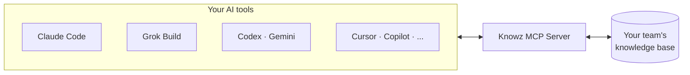

<div align="center">

# Knowz Skills

**Your knowledge base in every AI tool you use. Structured development that actually ships quality code.**

[](./LICENSE)
[](https://www.npmjs.com/package/knowzcode)
[](https://www.npmjs.com/package/knowz-mcp)

[Quick Start](#quick-start) · [Knowz](#knowz--knowledge-management) · [KnowzCode](#knowzcode--structured-development) · [Which One?](#which-one-do-i-need) · [Support](#privacy--support)

</div>

---

This repository is the public source for two plugins and the marketplace that serves them:

- **[Knowz](./knowz/)** — give your AI a persistent, team-wide memory
- **[KnowzCode](./knowzcode/)** — a disciplined development workflow with quality gates and TDD

Both are built on the open [Model Context Protocol](https://modelcontextprotocol.io/), so your knowledge base works with any compatible AI — Claude, Grok, ChatGPT, Gemini, Copilot, Cursor, Windsurf, or your own agents:



One knowledge base. Every AI tool in your workflow.

## Quick Start

**Claude Code**

```bash
# 1. Add the marketplace
/plugin marketplace add knowz-io/knowz-skills

# 2. Install what you need
/plugin install knowz@knowz-skills       # knowledge management
/plugin install knowzcode@knowz-skills   # structured development

# 3. Get going
/knowz register                          # create account + configure MCP
/knowzcode:setup                         # initialize in your project
```

**Grok Build**

```bash
# 1. Add the marketplace
grok plugin marketplace add knowz-io/knowz-skills

# 2. Install what you need (--trust activates MCP)
grok plugin install knowz --trust
grok plugin install knowzcode --trust

# 3. Get going (new session so skills and MCP attach)
/knowz register                          # create account + configure MCP
/knowzcode:setup                         # initialize in your project
```

The same `knowz-io/knowz-skills` repo is the catalog for both hosts. Grok reads `.grok-plugin/marketplace.json`; Claude Code reads `.claude-plugin/marketplace.json`.

## Knowz — Knowledge Management

Search, save, and query your knowledge base without leaving your editor. Knowz auto-detects when a conversation is relevant and surfaces the right context — or offers to capture new insights — without being asked.

```bash
/knowz ask "What's our convention for error handling?"
/knowz save "We chose Redis over Memcached for pub/sub support"
/knowz search "authentication patterns"
```

**[Knowz documentation →](./knowz/)**

## KnowzCode — Structured Development

Turns chaotic AI coding into a disciplined loop — analyze impact, design specs, build with tests, audit quality, ship — with an approval gate at every step. Scales from quick fixes to complex multi-file features, and works across 6 AI platforms.

```bash
/knowzcode:work "Build user authentication with email and password"
/knowzcode:explore "how is auth currently implemented?"
/knowzcode:relay "Build the approved plan with the other coding agent"
/knowzcode:fix "Fix typo in login button text"
```

**[KnowzCode documentation →](./knowzcode/)**

## Which One Do I Need?

| You want... | Install |
|-------------|---------|
| Your AI to remember team decisions, conventions, and lessons | **Knowz** |
| Disciplined feature development — gates, TDD, session continuity | **KnowzCode** |
| Knowledge-informed development: past decisions guide new work | **Both** — they integrate, but each works standalone |

## Learn More

- [Full feature overview](https://github.com/knowz-io/knowz-platform/blob/develop/FEATURES.md)
- [Knowz plugin](./knowz/) · [KnowzCode plugin](./knowzcode/) · [KnowzCode guides](./knowzcode/docs/)
- [knowz.io](https://knowz.io)

## Privacy & Support

- Privacy policy: [PRIVACY.md](./PRIVACY.md) and https://knowz.io/privacy
- Security reports: [SECURITY.md](./SECURITY.md)
- Support: support@knowz.io · Status: https://status.knowz.io

## License

`knowz/` and `knowzcode/` are MIT licensed — see [LICENSE](./LICENSE) and the package directories for details.
