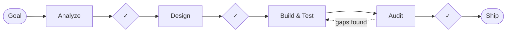

<div align="center">

# KnowzCode

**Structured AI development — quality gates, tests first, and continuity across sessions.**

[](LICENSE)
[](https://www.npmjs.com/package/@knowzai/knowzcode)
[](#platform-support)

[Quick Start](#quick-start) · [How It Works](#how-it-works) · [Commands](#commands) · [Profiles](#execution-profiles) · [Relay](#cross-agent-relay) · [Docs](#documentation)

</div>

---

AI coding assistants lack structure. Without it, they forget context between sessions, skip tests, make changes without considering impact, and declare "done" without verifying anything works.

KnowzCode brings discipline to AI-assisted development: impact analysis before design, specs before code, tests before implementation, and a quality audit before anything ships — with an approval gate at each step so you stay in control.

## Quick Start

```bash
# Claude Code
/plugin marketplace add knowz-io/knowz-skills
/plugin install knowzcode@knowz-skills
cd your-project/
/knowzcode:setup
```

```bash
# Grok Build
grok plugin marketplace add knowz-io/knowz-skills
grok plugin install knowzcode --trust
cd your-project/
/knowzcode:setup
```

```bash
# Any of the 6 supported platforms
npx @knowzai/knowzcode                                     # interactive setup
npx @knowzai/knowzcode install --platforms claude,gemini   # or pick platforms
```

Then start working:

```bash
/knowzcode:work "Build user authentication with email and password"   # full loop
/knowzcode:explore "how is authentication implemented?"               # research first
/knowzcode:fix "Fix typo in login button text"                        # quick fix, skips the loop
/knowzcode:regroup                                                     # save state before clearing context
# ...and later, just say "continue" to pick up where you left off
```

KnowzCode also offers a regroup automatically when you say things like "wrap up" or "step away" — it only asks; it never writes a handoff without approval.

## How It Works



Each diamond is an **approval gate** — you decide whether to proceed.

| Step | What Happens |
|------|-------------|
| **Analyze** | Scans your codebase for impact — what files change, what could break, what patterns to follow |
| **Design** | Drafts specifications with requirements and test criteria. You review before any code is written |
| **Build & Test** | Tests first, then code. Verification loops catch regressions |
| **Audit** | Quality review covering code quality, security, test coverage, and adherence to your standards |
| **Ship** | Commits, updates documentation, and captures learnings |

KnowzCode automatically classifies tasks by complexity, so small work skips the ceremony:

| Tier | When | What Happens |
|------|------|-------------|
| **Quick Fix** | Single file, small bug | Skips the loop. Fix, verify, done |
| **Light** | 3 files or fewer | Streamlined two-step path |
| **Full** | Complex features | Complete loop with all gates |

## When to Use It

KnowzCode adds overhead. Your agent's native mode is fine for single-file changes, small refactors, and anything you can verify at a glance. Reach for KnowzCode when:

- Outcomes aren't meeting expectations — the agent keeps missing edge cases or delivering incomplete work
- Multi-component changes — features that touch API + database + UI + tests
- Architecture and security matter
- You need documentation that stays current
- Long-running work spans sessions

The overhead pays for itself when the cost of getting it wrong exceeds the cost of being thorough.

## Commands

| Command | Description |
|---------|-------------|
| `/knowzcode:work <goal>` | Start a feature workflow |
| `/knowzcode:explore <topic>` | Research before implementing |
| `/knowzcode:fix <target>` | Quick targeted fix |
| `/knowzcode:relay <goal>` | Cross-agent relay: the host plans/reviews while the other agent implements |
| `/knowzcode:regroup [next step]` | Save a local handoff for clearing context |
| `/knowzcode:audit [type]` | Run quality audits (`spec`, `architecture`, `security`, `integration`, `compliance`) |
| `/knowzcode:setup` | Initialize in your project |
| `/knowzcode:status` | Check project status |
| `/knowzcode:telemetry` | Investigate production errors |
| `/knowzcode:telemetry-setup` | Configure telemetry sources (Sentry, App Insights) |

Two additional trigger skills run on intent rather than invocation: `start-work` (detects "implement the plan") and `regroup-trigger` (detects pause/wrap-up intent and offers a regroup).

## Execution Profiles

On Claude Code, four profiles trade cost, quality, and parallelism. You're asked once during setup and never re-asked.

| Profile | One-liner |
|---------|-----------|
| `frontier` (default) | Fable plans, specs, and reviews; Opus builds. The most capable planning, auto-falls back to Opus if Fable is unavailable |
| `teams` | All agents on their defaults (mostly Opus). No external dependencies — the opt-out from frontier's Fable cost |
| `advisor` | Sonnet builders consulting Opus mid-generation. ~12% cheaper where that quality is acceptable |
| `classic` | Deterministic single-threaded subagent execution |

```bash
/knowzcode:work "build X" --profile=teams    # per-run override
```

Full details — agent-by-agent model routing, fallback behavior, conflicts, rollback: **[docs/execution-profiles.md](./docs/execution-profiles.md)**.

## Context-Efficient Orchestration

KnowzCode routes each non-trivial unit through the cheapest safe context path:
keep it local, resume a compatible worker, use real provider inheritance when
eligible, send a fresh bounded context capsule, or form a genuine coordinated
team only when peers need shared task state or messaging.

The same contract works across Claude and Codex while preserving native
differences. Claude conversation forks are distinct from skill `context: fork`;
Codex uses semantic capability detection and never simulates Agent Teams. The
first independent reviewer always starts fresh from approved specs and diff
evidence.

Rollout begins in observe/shadow mode. Telemetry keeps logical context, billed
usage/cache counters, and accepted outcomes separate—cached input can cost less
while still occupying context. Promotion requires paired cost, latency,
quality, rework, and security evidence, so KnowzCode does not promise blanket
token removal.

Formal contract: **[knowzcode/specs/ContextEfficientOrchestration.md](./knowzcode/specs/ContextEfficientOrchestration.md)**.

## Cross-Agent Relay

> Experimental

The host keeps planning, review, gates, and finalization — the **other coding agent implements**. From Claude Code that's Codex; from Codex that's Claude Code. The target works headlessly on a dedicated branch, never commits, and gets bounded review-fix rounds before the host takes over anything left.

```bash
/knowzcode:relay Add rate limiting to the API   # delegate to the other agent
/knowzcode:work --relay=other <goal>            # or from a normal workflow
/knowzcode:work have Claude implement the approved plan
```

Setup, tuning, transports, and the safety model: **[docs/cross-agent-relay.md](./docs/cross-agent-relay.md)**.

## Enterprise Compliance & Custom Guidelines

> Beta

Wire your organization's own guidelines — security rules, API conventions, code-quality patterns, accessibility standards — into the workflow, enforced at the same quality gates you already approve. Author guidelines as markdown, register them in a manifest, and a persistent `enterprise-enforcer` blocks the audit gate on violations of anything you mark *blocking*. Opt-in and off by default.

Full guide: **[docs/enterprise-compliance.md](./docs/enterprise-compliance.md)**.

## Platform Support

| Platform | Install | Status |
|----------|---------|--------|
| Claude Code | `/plugin install knowzcode@knowz-skills` | Full |
| Grok Build | `grok plugin install knowzcode --trust` | Full |
| OpenAI Codex | `npx @knowzai/knowzcode install --platforms codex` | Full |
| Gemini CLI | `npx @knowzai/knowzcode install --platforms gemini` | Full |
| GitHub Copilot | `npx @knowzai/knowzcode install --platforms copilot` | Experimental |
| Cursor | `npx @knowzai/knowzcode install --platforms cursor` | Experimental |
| Windsurf | `npx @knowzai/knowzcode install --platforms windsurf` | Experimental |

## Connected to Knowz

KnowzCode optionally connects to [Knowz](https://knowz.io) for persistent knowledge across projects: past decisions become searchable during planning ("Why did we choose JWT over sessions?" gets a real answer), and durable learnings are captured automatically as you ship. Works fully without Knowz — the connection adds memory, not dependency.

## Documentation

| Guide | What it covers |
|-------|----------------|
| [Getting started](./docs/knowzcode_getting_started.md) | Complete walkthrough from install to first shipped feature |
| [Visual guide](./docs/knowzcode_guide.md) | The workflow, illustrated |
| [Understanding KnowzCode](./docs/understanding-knowzcode.md) | The node-based system underneath — concepts and rationale |
| [Workflow reference](./docs/workflow-reference.md) | Every phase, gate, and state in detail |
| [Prompts guide](./docs/knowzcode_prompts_guide.md) | Getting the most out of each command |
| [Execution profiles](./docs/execution-profiles.md) | Model routing, cost/quality trade-offs, fallbacks |
| [Cross-agent relay](./docs/cross-agent-relay.md) | Delegating implementation to the other coding agent |
| [Enterprise compliance](./docs/enterprise-compliance.md) | Custom guidelines enforced at quality gates |

## Privacy & Support

KnowzCode stores workflow state in local project files by default. It only sends data to Knowz when you have configured Knowz and choose a workflow that queries or writes vault knowledge. Telemetry workflows only connect to telemetry providers you configure.

- Privacy policy: [../PRIVACY.md](../PRIVACY.md) and https://knowz.io/privacy
- Support: support@knowz.io · Status: https://status.knowz.io
- Security reports: [../SECURITY.md](../SECURITY.md)

## Acknowledgments

KnowzCode builds upon ideas from the [Noderr project](https://github.com/kaithoughtarchitect/noderr) by [@kaithoughtarchitect](https://github.com/kaithoughtarchitect).

## License

MIT — see [LICENSE](LICENSE).

---

<div align="center">

[Full capabilities](https://github.com/knowz-io/knowz-platform/blob/develop/FEATURES.md#knowzcode--structured-ai-development) · [knowz.io](https://knowz.io)

</div>
