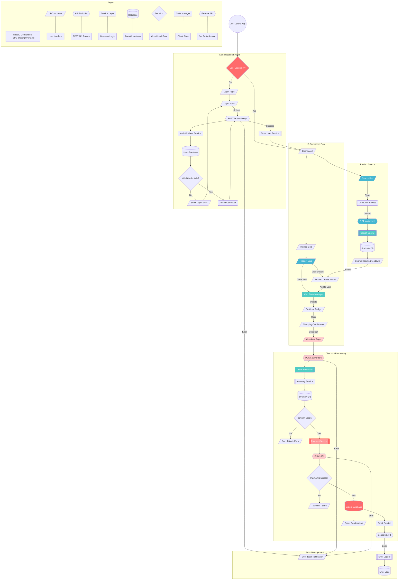

# Understanding KnowzCode: The Node-Based AI Coding System

## What Makes KnowzCode Different

### 1. Building Blocks with Identity (NodeIDs)

Every piece of your system gets a unique, permanent name - we call these **NodeIDs**:

- `Authentication` - Everything related to login, tokens, and auth
- `FileManagement` - File upload, preview, and storage
- `Checkout` - Cart, orders, and payment processing
- `LIB_DateFormat` - An isolated utility for date formatting

Unlike traditional AI coding where the AI forgets what it built between conversations, NodeIDs give each domain area a permanent identity that persists forever.

**Think of it like this**: Instead of telling AI "update the login", you can say "update `Authentication`" and it knows EXACTLY what you mean, even months later. One domain-area spec covers all related components.

### 2. Visual Architecture That Remembers

These NodeIDs aren't just labels - they live in a visual map (Mermaid diagram) that shows:
- **WHERE** each piece fits in your system
- **HOW** it connects to other pieces
- **WHAT** depends on it



The AI uses this visual memory to understand that changing `API_AuthCheck` will affect both the login form above it and the validator below it.

**How this helps:**

Traditional AI: "Here's a login function" → Next session: "What login function?"

KnowzCode AI: "I see `UI_LoginForm` connects to `API_AuthCheck` which validates through `SVC_TokenValidator`" → Always remembers the entire system

### 3. Blueprints for Every Building Block (Specifications)

Each NodeID has its own detailed blueprint file in the `knowzcode/specs/` folder:
- `UI_LoginForm` → `knowzcode/specs/UI_LoginForm.md`
- `API_AuthCheck` → `knowzcode/specs/API_AuthCheck.md`

These specs are lean decision records containing:
- **Rules & Decisions**: Key architectural decisions, business rules, and constraints
- **Interfaces**: Public contracts, API signatures, and dependencies
- **Verification Criteria**: Testable `VERIFY:` statements that prove correctness
- **Debt & Gaps**: Known limitations and future work

### 4. Lightning-Fast Context Assembly

Here's how it all works together:

1. **You say**: "Fix the login timeout issue"

2. **AI looks at the architecture**: 
   - Finds `API_AuthCheck` in the visual map
   - Sees it connects to `UI_LoginForm`, `SVC_TokenValidator`, and `DB_Users`

3. **AI reads the relevant specs**:
   - Instead of searching through hundreds of files
   - It knows EXACTLY which specs to read
   - Gets clean, structured context immediately

4. **AI has perfect understanding**:
   - Knows what each piece does
   - Knows how they connect
   - Knows what changes are safe to make

### 5. Your Mission Control Dashboard (knowzcode/knowzcode_tracker.md)

Think of this as your project's control center - everything visible at a glance:

| Column | What It Reveals |
|:---|:---|
| **Status** | ⚪️ TODO, 📝 NEEDS_SPEC, 🟡 WIP, 🟢 VERIFIED, ❗ ISSUE |
| **WorkGroupID** | Which features are being built together (e.g., `feat-20250107-143022`) |
| **NodeID** | The unique building block identifier |
| **Label** | Human-friendly name |
| **Dependencies** | What must be built first |
| **Logical Grouping** | System category (Auth, Payments, UI, etc.) |
| **Spec Link** | One-click access to blueprints |
| **Classification** | Risk level (Standard/Complex/Critical) |
| **Notes/Issues** | Important warnings or blockers |

#### The Hidden Intelligence

**See What Changes Together:**
```
| Status | WorkGroupID | NodeID | Label |
|:---|:---|:---|:---|
| 🟡 | feat-20250107-143022 | UI_LoginForm | Login Form |
| 🟡 | feat-20250107-143022 | API_AuthCheck | Auth Endpoint |
| 🟡 | feat-20250107-143022 | SVC_TokenValidator | Token Service |
```
All three are being built as one coordinated change!

**Know Your Risk Levels:**
- 🟢 **Standard**: Regular features
- 🟡 **Complex**: Needs extra attention  
- 🔴 **Critical**: Security, payments, or core stability

**Track Real Progress:**
- See overall completion percentage
- Know what's blocking what
- Identify technical debt (REFACTOR_ tasks)
- One-click access to any component's details

### 6. Your Project's Flight Recorder (knowzcode/knowzcode_log.md)

Think of this as your project's **permanent memory** - a detailed history of every important decision, change, and event:

#### What Gets Logged

Every significant action creates a timestamped entry:

- **🚀 SystemInitialization**: Project started
- **📋 SpecApproved**: Blueprint for `API_AuthCheck` approved
- **✅ ARC-Completion**: Login feature built, tested, and verified
- **🔧 MicroFix**: Fixed typo in error message
- **❗ Issue**: API timeout discovered, investigating
- **♻️ RefactorCompletion**: Optimized database queries
- **🎯 FeatureAddition**: Payment system scope added

#### Why History Matters

**Traditional AI:** 
- "Why does this code look weird?" 
- AI: "I don't know, I didn't write it"

**With KnowzCode's Log:**
- "Why does this code look weird?"
- AI: "I can see from the log that on Jan 15, we had to work around a third-party API limitation"

#### Real Example Entry

```markdown
---
**Type:** ARC-Completion
**Timestamp:** 2025-01-07T14:30:22Z
**WorkGroupID:** feat-20250107-143022
**NodeID(s):** UI_LoginForm, API_AuthCheck, SVC_TokenValidator
**Details:**
Successfully implemented and verified the Change Set for user authentication.
- **ARC Verification Summary:** All security criteria met, 15 tests passing
- **Architectural Learnings:** Discovered need for rate limiting
- **Unforeseen Ripple Effects:** UI_Dashboard needs update for new auth state
- **Technical Debt Created:** REFACTOR_API_AuthCheck (optimize token generation)
---
```

From this single entry, future AI sessions know:
- What was built together
- When it happened
- What was discovered during building
- What technical debt was created
- What else needs attention

#### The Hidden Second Purpose: Quality Standards

The log also contains your project's **quality criteria** - the standards every piece of code must meet:

- **Reliability**: Error handling, fault tolerance
- **Security**: Input validation, authentication
- **Performance**: Response times, resource usage
- **Maintainability**: Code clarity, documentation

This ensures the AI doesn't just build features - it builds them RIGHT, according to your project's specific standards.

### 7. The KnowzCode Loop - The Engine That Runs Everything

The Loop gives AI-assisted development a repeatable, verified workflow. Each prompt is like a checkpoint that ensures quality at every stage.

#### Starting Every Session

Start with `/knowzcode:work "your goal"` (Claude Code) or the Loop 1A prompt (any platform):
- AI reads the log (what happened before)
- Checks the tracker (what's the current state)
- Analyzes impact for your goal
- **You:** Approve the proposed Change Set

#### 🔄 The KnowzCode Workflow

**Step 1A: Impact Analysis** 
*Prompt:* `knowzcode/prompts/[LOOP_1A]__Propose_Change_Set.md`
- You provide a goal (e.g., "Add password reset").
- The AI analyzes the system and proposes a "Change Set" of all affected NodeIDs.
**⏸️ PAUSES** - You approve the full scope.

**Step 1B: Blueprint Creation**
*Prompt:* `knowzcode/prompts/[LOOP_1B]__Draft_Specs.md`
- The AI drafts detailed specifications for every NodeID in the Change Set.
**⏸️ PAUSES** - You review the blueprints.

**Quality Gate 1: Specification Verification (Optional)**
*Prompt:* `knowzcode/prompts/Spec_Verification_Checkpoint.md`
- For large Change Sets (≥10 nodes), this read-only check ensures all specs are complete and logical *before* implementation starts.

**Step 2A: Implementation**
*Prompt:* `knowzcode/prompts/[LOOP_2A]__Implement_Change_Set.md`

This is where implementation happens:
1. **Context Assembly** - AI reads only what it needs:
   - Looks at architecture → finds connected nodes
   - Reads relevant specs → understands requirements  
   - Loads specific code → sees current implementation

2. **Coordinated Building** - Everything at once:
   - Not piecemeal changes
   - All UI + API + DB changes together
   - Maintains consistency

3. **Initial ARC Verification** - The AI performs a first pass on the quality gates, checking against the spec's criteria.

**Quality Gate 2: Implementation Audit**
*Prompt:* `knowzcode/prompts/[LOOP_2B]__Verify_Implementation.md`
- A mandatory, read-only audit where the AI compares the code to the specs.
- It reports a true completion percentage (e.g., "85% complete").
**⏸️ PAUSES** - You decide whether to accept the work or send it back for completion.

**Step 3: Document & Commit**
*Prompt:* `knowzcode/prompts/[LOOP_3]__Finalize_And_Commit.md`
- The AI updates specs to an "as-built" state, logs the work, updates the tracker, and makes the final git commit.
**✅ COMPLETE**

#### 💡 Why Each Step Matters

| Step | Without It | With It |
|:-----|:-----------|:--------|
| **1A** | AI changes random files | AI sees full impact |
| **1B** | AI codes by guessing | AI has clear blueprints |
| **2** | "Hope it works" | Verified quality |
| **3** | Lost knowledge | Perfect memory |

#### 🎯 What Makes This Different

**Traditional AI Coding:**
- You: "Add password reset feature"
- AI: *writes some code in isolation*
- You: "What about the existing auth system?"
- AI: "Let me look at that again and make some adjustments..."

**With The Loop:**
- You: "Add password reset feature"
- AI: "I'll need to modify 3 components, here's why..."
- You: "Approved"
- AI: "Built, tested, verified, documented. Here's what I learned..."

#### 📋 Your Role as Orchestrator

You're like an architect reviewing plans:
- **Start**: Provide clear goals
- **Loop 1A**: Approve the scope
- **Loop 1B**: Approve the blueprints
- **Loop 2A**: Authorize implementation
- **Loop 2B**: Review the audit and decide next steps
- **Loop 3**: Everything happens automatically

The AI does the heavy lifting, but you maintain control at every critical decision point.

### 7.5 Quality Gates - The Trust But Verify System

KnowzCode operates on a "trust but verify" principle, enforced by two critical quality gates that prevent common AI development failures.

#### Quality Gate 1: Specification Verification Checkpoint

- **When:** After drafting specs (Loop 1B), recommended for Change Sets of 10+ NodeIDs.
- **What:** A read-only check to ensure every specification is complete, logical, and has clear verification criteria.
- **Why:** It prevents the AI from starting a large implementation based on flawed or incomplete blueprints, which is a major source of wasted effort.

#### Quality Gate 2: Implementation Audit (Loop 2B)

- **When:** Always, after the AI reports implementation is "complete" (Loop 2A).
- **What:** A mandatory, read-only audit where the AI systematically compares the written code against the requirements in the specification files.
- **Why:** This is the most critical gate. It provides an objective, quantitative measure of completeness. It catches gaps, unimplemented error handling, and deviations from the plan, preventing "hallucinated" or incomplete features from being committed.

**Example: Catching Incomplete Work**
> **AI in Loop 2A:** "Implementation is complete!"
>
> **AI in Loop 2B (Audit):** "Audit reveals only 7 out of 10 requirements were met (70% completion). The payment timeout logic and two security validation criteria were not implemented."
>
> **You (Orchestrator):** "Return to Loop 2A to complete the missing requirements."

These gates ensure that what is claimed to be done is actually done, and that what is being built is based on solid plans.

### 8. Change Sets & WorkGroupIDs - Coordinated Development

One of KnowzCode's key innovations is recognizing that features rarely touch just one component. Change Sets ensure everything that needs to change together, changes together.

#### What is a Change Set?

A Change Set is all the NodeIDs that must be modified together to implement a feature. It includes:
- **New nodes** that need to be created
- **Existing nodes** that need modification

**Example Change Set for "Add Password Reset":**
```
Change Set:
- NEW: UI_PasswordResetForm
- NEW: API_PasswordReset  
- NEW: EMAIL_ResetTemplate
- MODIFY: UI_LoginPage (add "forgot password" link)
- MODIFY: DB_Users (add reset_token field)
- MODIFY: SVC_EmailSender (add reset email method)
```

#### What is a WorkGroupID?

When work begins on a Change Set, all nodes get tagged with the same WorkGroupID:
- Format: `[type]-[date]-[time]`
- Example: `feat-20250115-093045`

This creates a "work bubble" where:
- All related changes are tracked together
- No node can be marked complete alone
- Everything ships as one cohesive update

#### Why This Prevents Broken Systems

**Without Change Sets:**
- Developer updates login page ✓
- Forgets to update the API ✗
- Result: Broken feature

**With Change Sets:**
- All 6 components identified upfront
- All marked WIP together
- All verified together
- All completed together
- Result: Everything works!

### 9. ARC Verification - The Quality Gates That Matter

ARC (Attentive Review & Compliance) is the verification system that ensures code meets spec before it ships. It's a comprehensive verification system that ensures every piece of code meets professional standards.

#### What Makes ARC Different

**Traditional AI Coding:**
- AI: "I wrote the login function, it works!"
- Reality: Works for happy path, breaks with wrong input, no error handling

**With ARC Verification:**
- AI must verify against specific criteria in each spec
- Not just "does it run?" but "does it handle all scenarios?"

#### The Four Pillars of ARC

1. **Functional Criteria** - Does it do what it's supposed to?
   ```markdown
   ✓ When user submits valid data, form saves to database
   ✓ When user is not authenticated, redirect to login
   ✓ When item is deleted, all references are cleaned up
   ```

2. **Input Validation Criteria** - Does it handle bad input gracefully?
   ```markdown
   ✓ When email field receives "notanemail", show validation error
   ✓ When required field is empty, prevent submission
   ✓ When number field receives text, reject with clear message
   ```

3. **Error Handling Criteria** - Does it fail gracefully?
   ```markdown
   ✓ When database is unreachable, return 503 with retry info
   ✓ When external API times out, use cached data or queue
   ✓ When file upload fails, clean up partial data
   ```

4. **Quality Criteria** - Is it maintainable and secure?
   ```markdown
   ✓ All functions have clear documentation
   ✓ No passwords or secrets in code
   ✓ Response times under 200ms for common operations
   ```

#### How ARC Works in Practice

During Loop Step 2, when implementing a feature:

1. **AI reads the ARC criteria** from the spec
2. **Builds the feature** with all criteria in mind
3. **Tests each criterion** systematically
4. **If any fail** → Fix and re-verify everything
5. **Only proceeds** when 100% of criteria pass

#### Real Example: Login Endpoint

**Without ARC:**
```javascript
app.post('/login', (req, res) => {
  const user = db.findUser(req.body.email);
  if (user.password === req.body.password) {
    res.json({ token: generateToken(user) });
  }
});
```

**With ARC:**
```javascript
app.post('/login', rateLimiter, async (req, res, next) => {
  try {
    // ARC: Input validation
    const { error } = loginSchema.validate(req.body);
    if (error) return res.status(400).json({ error: error.details });
    
    // ARC: Functional requirement
    const user = await db.findUser(req.body.email);
    if (!user) return res.status(401).json({ error: 'Invalid credentials' });
    
    // ARC: Security requirement
    const validPassword = await bcrypt.compare(req.body.password, user.hashedPassword);
    if (!validPassword) return res.status(401).json({ error: 'Invalid credentials' });
    
    // ARC: Functional requirement
    const token = generateToken(user);
    
    // ARC: Audit requirement
    await logLoginAttempt(user.id, 'success');
    
    res.json({ token });
  } catch (error) {
    // ARC: Error handling requirement
    await logLoginAttempt(req.body.email, 'error');
    next(error);
  }
});
```

#### Why This Matters

ARC enforces quality by:
- Defining "done" explicitly, not subjectively
- Catching issues before they reach production
- Ensuring consistent quality across all features
- Building reliability into the development process

### 10. The Environment Context - Teaching AI Your World

The `knowzcode/environment_context.md` file is what makes KnowzCode work anywhere - it's the bridge between KnowzCode's universal instructions and your specific environment.

#### Design

This file has three roles:

1. **Instructions TO the AI** - It starts with detailed instructions teaching the AI how to discover and document the environment

2. **A Template to Fill** - It provides a structured format with placeholders that the AI replaces with tested, working commands

3. **Discovery Commands** - It includes specific commands for the AI to run to understand the environment:
   ```bash
   pwd                          # Where are you?
   uname -a                     # What OS?
   which git node npm python3   # What tools exist?
   env | grep -E "REPL|CLOUD"   # Any special environment vars?
   ```

#### How It Works

1. **During installation** → The AI reads the template instructions
2. **AI runs discovery** → Tests every command in the actual environment
3. **AI creates filled version** → `knowzcode/environment_context_replit_nodejs.md`
4. **AI uses it forever** → Now knows exactly how to work in your setup

#### What Gets Documented

**Universal Need → Specific Command:**
```yaml
# Instead of: "run tests"
testing:
  unit_tests: "npm test"          # On Node.js
  unit_tests: "python -m pytest"  # On Python
  unit_tests: "cargo test"        # On Rust

# Instead of: "check port availability"  
port_check:
  mac: "lsof -i :3000"
  linux: "netstat -an | grep 3000"
  windows: "netstat -an | findstr 3000"
```

#### Why This Matters

**Without Environment Context:**
- AI: "Run `npm test`"
- You: "I'm using Python..."
- AI: "Oh, then run `pytest`"
- You: "Command not found"
- AI: "Is pytest installed?"
- *Endless back-and-forth...*

**With Environment Context:**
- AI already knows: `python -m pytest` works in your setup
- Commands work first time
- No platform confusion

#### Real-World Example

When the Loop says "perform ARC Verification", the AI consults knowzcode/environment_context.md:

```yaml
# For a Node.js project on Replit:
verification:
  lint: "npm run lint"
  test: "npm test"
  build: "npm run build"
  
# For a Python project on local Mac:
verification:
  lint: "flake8 . --max-line-length=100"
  test: "python -m pytest -v"
  build: "python -m build"
```

The same KnowzCode Loop works perfectly in both environments!

#### The Critical Step

This is why filling out `knowzcode/environment_context.md` is critical during installation - without it, the AI is like a skilled builder arriving at a job site without knowing whether they're in New York or Tokyo. Different places have different tools, different rules, different ways of doing things.

This isn't overengineering - it's acknowledging the messy reality that every development environment is unique. By documenting it once during the installation process, you prevent countless failed commands and confused debugging sessions.

### 11. The Project Constitution (knowzcode/knowzcode_project.md) - Your Living PRD

The `knowzcode/knowzcode_project.md` file is your project's constitution - a comprehensive PRD (Product Requirements Document) that evolves with your project. Unlike traditional PRDs that gather dust, this one is actively used by the AI in every session.

#### What Makes This Special

**Traditional PRD:** Written once, rarely updated, often ignored
**KnowzCode Project File:** Living document that AI reads before every coding session

#### What It Contains (Your Project's DNA)

1. **The Vision & Problem**
   - What you're building and why
   - The core problem being solved
   - Target users and their needs

2. **The Scope (MVP Definition)**
   ```markdown
   In Scope:
   - User authentication
   - Core feature X
   - Basic reporting
   
   Out of Scope (for now):
   - Advanced analytics
   - Third-party integrations
   - Mobile app
   ```
   This prevents scope creep - AI knows what NOT to build!

3. **The Tech Stack (Exact Versions)**
   ```markdown
   | Category | Technology | Version | Why |
   |:---------|:-----------|:--------|:----|
   | Language | Node.js | 20.11.0 | Fast, huge ecosystem |
   | Framework | Express | 4.18.2 | Simple, well-documented |
   | Database | PostgreSQL | 15.x | Robust, ACID compliant |
   ```
   AI uses these EXACT versions - no surprises!

4. **Coding Standards (The Law)**
   - Style guide to follow (Airbnb, PEP8, etc.)
   - Naming conventions
   - Comment requirements
   - Commit message format
   
   Every line of code AI writes follows these rules!

5. **Quality Priorities (What Matters Most)**
   ```markdown
   Top 3 Priorities:
   1. Security - This handles financial data
   2. Reliability - Must have 99.9% uptime
   3. Performance - Sub-200ms response times
   ```
   AI optimizes for YOUR priorities, not generic "best practices"

6. **Architecture Decisions & Rationale**
   ```markdown
   Decision: Monolithic architecture for MVP
   Rationale: Faster to build, easier to deploy, 
             can refactor to microservices later
   ```
   AI understands not just WHAT but WHY

#### How AI Uses This File

**When you say:** "Add a new API endpoint"

**AI checks project file for:**
- Naming convention: `API_ResourceAction`
- Framework patterns: Express middleware style
- Auth requirements: All endpoints need auth except public list
- Error handling: Standard error response format
- Testing: Requires unit and integration tests

**Result:** Consistent, compliant code every time

#### The Living Document Advantage

As your project evolves:
- Tech stack updates → Update here
- New coding standards → Update here  
- Scope expansions → Update here
- Lessons learned → Update here

The AI immediately adapts to all changes!

**Note on Maintenance:** The KnowzCode Loop is designed to keep this document current. Step 10.3 of the main loop (`knowzcode/knowzcode_loop.md`) includes a check to see if a completed Change Set impacts the project's scope, technology, or architecture, prompting an update to this file as part of the finalization process.

#### Real Example Impact

Without knowzcode/knowzcode_project.md:
```javascript
// AI might write:
app.get('/getUsers', (req, res) => {
  db.query('SELECT * FROM users').then(data => res.json(data))
})
```

With knowzcode/knowzcode_project.md:
```javascript
// AI writes (following all standards):
app.get('/api/v1/users', authenticate, authorize('read:users'), async (req, res, next) => {
  try {
    const users = await userService.findAll(req.query);
    res.json({ success: true, data: users });
  } catch (error) {
    next(error);
  }
});
```

Same request, vastly different quality!

#### Why This Matters

You're not just telling AI "build features" - you're establishing:
- **WHAT** to build (scope)
- **HOW** to build it (standards)
- **WHY** decisions were made (rationale)
- **WHO** it's for (users)
- **WHICH** tools to use (stack)

### 12. The Planning Directory - Strategic Thinking Space

The `knowzcode/planning/` directory is where strategic analysis happens before code begins.

#### What Lives Here

**Feature Breakdowns:**
```markdown
knowzcode/planning/
├── feature_breakdown_20250115_093000.md
├── payment_integration_analysis.md
└── scaling_strategy_v2.md
```

These documents contain:
- Detailed feature analysis
- Priority matrices
- Technical feasibility studies
- Architecture proposals
- Risk assessments

#### How the Planning Process Works

**Step 1: Raw Ideas → Structured Analysis**

Use `/knowzcode:plan "your ideas"` (Claude Code) or start a planning conversation with your AI:

```
You: "Here are my ideas:
     - Add social login
     - Email notifications
     - Dark mode
     - API rate limiting"

AI: Creates → knowzcode/planning/feature_breakdown_20250115_093000.md
```

The AI analyzes EACH idea and produces:
- User story format
- Impact assessment (High/Medium/Low)
- Technical complexity estimate
- Potential NodeIDs needed
- Dependencies on other features
- Priority recommendation

**Step 2: The Generated Planning Document**

```markdown
# Feature Breakdown & Prioritization Report

## 1. Detailed Feature Analysis

### Feature: Social Login
- **User Story**: "As a user, I want to login with Google/GitHub 
                  so that I don't need another password"
- **User Impact**: High
- **Technical Complexity**: Medium
- **Potential NodeIDs**:
  - NEW: UI_SocialLoginButtons
  - NEW: API_OAuthCallback
  - MODIFY: API_AuthCheck
  - MODIFY: DB_Users (add oauth_provider field)
- **Dependencies**: None

### Feature: Dark Mode
- **User Impact**: Medium
- **Complexity**: Low
- **Potential NodeIDs**:
  - NEW: UI_ThemeToggle
  - MODIFY: All UI nodes (add theme support)
- **Dependencies**: None

## 2. Prioritized Summary

| Feature | Impact | Complexity | Priority | Start Time |
|:--------|:-------|:-----------|:---------|:-----------|
| API Rate Limiting | High | Low | P1 | Now |
| Social Login | High | Medium | P1 | After rate limiting |
| Dark Mode | Medium | Low | P2 | Sprint 2 |

## 3. Recommendation
Start with API Rate Limiting - high security impact, low effort.
```

#### How It Feeds Into Development

1. **Strategic Planning** → Use Feature Breakdown prompt
2. **AI creates planning doc** → Saved in `knowzcode/planning/`
3. **Review & decide** → Pick top priority feature
4. **Start the Loop** → "Primary Goal: Implement API rate limiting"
5. **AI references plan** → Already knows the NodeIDs and approach

#### Planning Workflows

- **`/knowzcode:plan "deep dive into feature X"`** — Focused investigation of a specific feature before building
- **`/knowzcode:work "add major feature to existing project"`** — The standard workflow handles both new features and additions to existing projects

#### Why Planning Matters

This directory prevents:
- Half-baked features entering development
- Discovering complexity mid-build
- Building low-impact features first
- Scope creep during implementation

The planning prompts transform your "wouldn't it be cool if..." ideas into actionable, prioritized development plans that feed directly into the KnowzCode Loop.

## 🎭 The Complete KnowzCode System

**NodeIDs** (permanent identity) + **Visual Architecture** (spatial memory) + **Specifications** (detailed blueprints) + **Tracker** (mission control) + **Log** (historical memory) + **The Loop** (systematic process) + **Change Sets** (coordinated updates) + **ARC Verification** (quality gates) + **Environment Context** (local knowledge) + **Project Constitution** (vision & standards) + **Planning Directory** (strategic thinking) = **a structured AI development workflow**

It's like giving the AI:
- A map of your city (architecture)
- Street addresses (NodeIDs)  
- Building blueprints (specs)
- A control center (tracker)
- A complete history book (log)
- Professional development process (the loop)
- Coordinated construction crews (change sets)
- Quality inspection standards (ARC)
- Local building codes and tools (environment context)
- The city's master plan and building standards (project file)
- A strategic planning office (planning directory)

Together, these give the AI complete system context, quality standards, and environment awareness for your project.

## Why This Works

1. **No Lost Context**: Every conversation starts with perfect system knowledge
2. **No Blind Changes**: AI sees all ripple effects before coding
3. **No Broken Features**: Change Sets ensure all related pieces update together
4. **No Forgotten Details**: Specs capture everything important
5. **No Confusion**: Clear status and dependencies for everything
6. **No Technical Debt Hiding**: It's tracked and scheduled automatically
7. **No Repeated Mistakes**: AI learns from logged decisions and issues
8. **No Chaotic Development**: The Loop ensures systematic, quality-driven building
9. **No "Works on My Machine"**: ARC Verification ensures professional quality
10. **No Environment Confusion**: AI knows exactly how to work in YOUR specific setup
11. **No Inconsistent Code**: Every line follows YOUR project's standards and vision
12. **No Half-Baked Features**: Planning directory ensures thorough thinking before coding

This structure gives AI-assisted development consistent context, verified quality, and project continuity.
