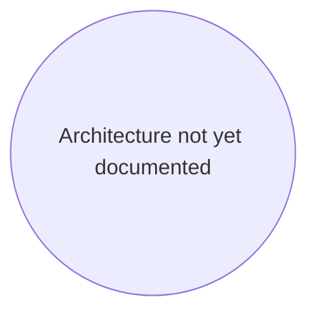

# KnowzCode — Architectural Flowchart

**Purpose:** Mermaid flowchart defining this project's architecture, components (NodeIDs), and primary interactions. Source of truth for components tracked in `knowzcode_tracker.md`.

## Diagram

