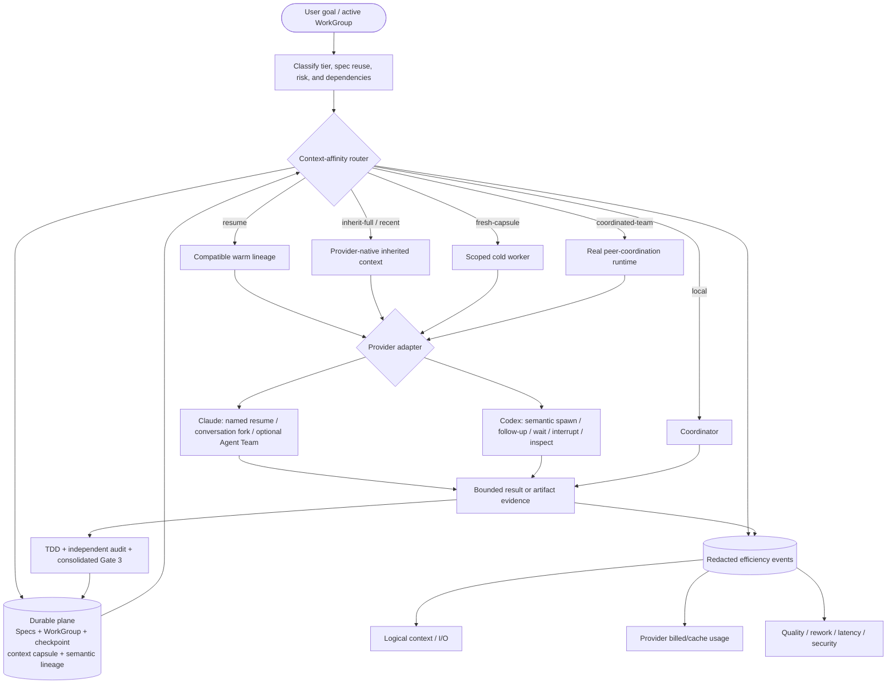

# KnowzCode — Architectural Flowchart

**Purpose:** Mermaid flowchart defining this project's architecture, components (NodeIDs), and primary interactions. Source of truth for components tracked in `knowzcode_tracker.md`.

## Diagram

```mermaid
flowchart TD
    Goal(["User goal / active WorkGroup"]) --> Classify["Classify tier, spec reuse, risk, and dependencies"]
    Classify --> Router{"Context-affinity router"}

    Router -->|"local"| Local["Coordinator"]
    Router -->|"resume"| Resume["Compatible warm lineage"]
    Router -->|"inherit-full / recent"| Inherit["Provider-native inherited context"]
    Router -->|"fresh-capsule"| Fresh["Scoped cold worker"]
    Router -->|"coordinated-team"| Team["Real peer-coordination runtime"]

    Resume --> Adapter{"Provider adapter"}
    Inherit --> Adapter
    Fresh --> Adapter
    Team --> Adapter
    Adapter --> Claude["Claude: named resume / conversation fork / optional Agent Team"]
    Adapter --> Codex["Codex: semantic spawn / follow-up / wait / interrupt / inspect"]

    Durable[("Durable plane\nSpecs + WorkGroup + checkpoint\ncontext capsule + semantic lineage")] --> Router
    Router --> Durable
    Claude --> Evidence["Bounded result or artifact evidence"]
    Codex --> Evidence
    Local --> Evidence
    Evidence --> Gates["TDD + independent audit + consolidated Gate 3"]
    Gates --> Durable

    Router --> Telemetry[("Redacted efficiency events")]
    Evidence --> Telemetry
    Telemetry --> Logical["Logical context / I/O"]
    Telemetry --> Billed["Provider billed/cache usage"]
    Telemetry --> Outcome["Quality / rework / latency / security"]
```

## Component Notes

- **ContextEfficientOrchestration** owns portable modes, capsules, lineage/leases, budgets, output policy, telemetry, and evaluation gates.
- **ClaudeRuntimeCompatibility** maps portable modes to current named-agent resume, real conversation fork, fresh subagent, and optional team semantics while preserving strict relay isolation.
- **CodexRuntimeParity** owns the canonical Codex execution guide, semantic runtime capability mapping, conditional result policy, and npm/plugin/install equality.
- Provider sessions, agent IDs, and caches are ephemeral optimizations. Durable recovery depends only on repository state, approved specs, checkpoints, WorkGroup state, and a valid capsule.
- The lead-owned no-write runtime classifies vault deltas before any persistence; `skip`/`batch` stay local, while `amend`/`update`/`flush` route through one authorized writer or direct mutation.
- Rollout promotion requires exact measured provenance, 40 balanced pairs across five mandatory strata, and non-weakenable economic, quality, security, and reconciliation gates.
- Generated Claude, Codex, Gemini, and Copilot surfaces are owned by exact product manifests and content digests. Lifecycle operations preflight containment, file type, symlinks, settings shape, and collisions before mutation; unowned state is preserved.
- Knowz and KnowzCode share Gemini's `mcpServers.knowz` entry only through independent digest claims backed by product-specific active-install evidence. Co-owned entries are immutable until one owner leaves, and only the final matching owner removes the entry.
