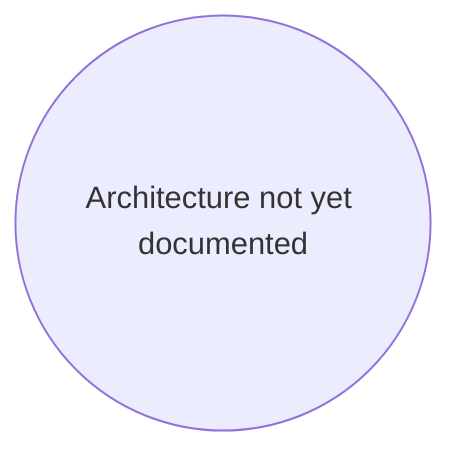

# KnowzCode Init — Template Files

These templates are generated during `/knowzcode:setup` Step 3. Create each file in the `knowzcode/` directory.

## knowzcode_project.md
```markdown
# KnowzCode Project Overview

**Purpose:** Project context for KnowzCode AI agents.

### 1. Project Goal & Core Problem
*   **Goal:** [To be filled in during first session]
*   **Core Problem Solved:** [To be filled in during first session]

### 2. Scope & Key Features
*   **Key Features (In Scope):**
    *   [Feature 1]: [Description]
*   **Out of Scope:**
    *   [Deferred 1]: [Description]

### 3. Technology Stack
| Category | Technology | Version | Notes |
|:---------|:-----------|:--------|:------|
| Language(s) | [Detected] | [Detected] | [Auto-detected] |
| Testing | [Detected] | [Detected] | [Auto-detected] |

### Links to Other Artifacts
* **Loop Protocol:** `knowzcode/knowzcode_loop.md`
* **Session Log:** `knowzcode/knowzcode_log.md`
* **Architecture:** `knowzcode/knowzcode_architecture.md`
* **Tracker:** `knowzcode/knowzcode_tracker.md`
* **Specifications:** `knowzcode/specs/`
```

## knowzcode_tracker.md
```markdown
# KnowzCode Status Map (WorkGroup Tracker)

**Purpose:** Tracks all active and completed WorkGroups.

## Active WorkGroups

*None yet. Run `/knowzcode:work "your feature description"` to create your first WorkGroup.*

## Completed WorkGroups

*None yet.*

**Next WorkGroup ID:** WG-001
```

## knowzcode_log.md
```markdown
# KnowzCode Operational Record

**Purpose:** Session log and quality criteria reference.

## Recent Sessions

*No sessions yet.*

## Reference Quality Criteria

1. **Reliability:** Robust error handling, graceful degradation
2. **Maintainability:** Clear code structure, good naming, modularity
3. **Security:** Input validation, secure authentication, data protection
4. **Performance:** Efficient algorithms, optimized queries
5. **Testability:** Comprehensive test coverage, clear test cases
```

## knowzcode_architecture.md
````markdown
# KnowzCode — Architectural Flowchart

**Purpose:** Mermaid flowchart defining this project's architecture, components (NodeIDs), and primary interactions. Source of truth for components tracked in `knowzcode_tracker.md`.

## Diagram


````

## environment_context.md
```markdown
# KnowzCode Environment Context

**Purpose:** Environment and tooling information.

## Detected Environment

**Platform:** [Auto-detected]
**Language:** [Auto-detected]
**Package Manager:** [Auto-detected]
**Test Runner:** [Auto-detected]
```

## knowzcode_orchestration.md
```markdown
# KnowzCode Orchestration Configuration

**Purpose:** Project-level defaults for team sizing and agent orchestration. Read by `/knowzcode:work` and `/knowzcode:audit` at startup. Per-invocation flags override these settings.

---

## Builder Configuration

```yaml
max_builders: 5
```

---

## Specialist Defaults

```yaml
default_specialists: []
```

---

## MCP Agent Configuration

```yaml
mcp_agents_enabled: true
```

---

## Override Precedence

| Setting | Config Default | Flag Override |
|---------|---------------|--------------|
| max_builders | `max_builders:` | `--max-builders=N` |
| default_specialists | `default_specialists:` | `--specialists`, `--no-specialists` |
| mcp_agents_enabled | `mcp_agents_enabled:` | `--no-mcp` |

Per-invocation flags always win. `--specialists` adds to defaults; `--no-specialists` clears all.
```
