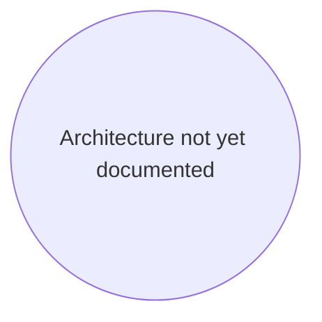

# KnowzCode Init — Template Files

These templates are generated during `/knowzcode:setup` Step 3. Create each file in the `knowzcode/` directory.

## Contents

- [knowzcode_project.md](#knowzcode_projectmd)
- [knowzcode_tracker.md](#knowzcode_trackermd)
- [knowzcode_log.md](#knowzcode_logmd)
- [knowzcode_architecture.md](#knowzcode_architecturemd)
- [environment_context.md](#environment_contextmd)
- [knowzcode_orchestration.md](#knowzcode_orchestrationmd)

## knowzcode_project.md
```markdown
# KnowzCode Project Overview

**Purpose:** Project context for KnowzCode AI agents.

### 1. Project Goal & Core Problem
*   **Goal:** [To be filled in during first session]
*   **Core Problem Solved:** [To be filled in during first session]

### 2. Scope & Key Features
*   **Key Features (In Scope):**
    *   [Feature 1]: [Description]
*   **Out of Scope:**
    *   [Deferred 1]: [Description]

### 3. Technology Stack
| Category | Technology | Version | Notes |
|:---------|:-----------|:--------|:------|
| Language(s) | [Detected] | [Detected] | [Auto-detected] |
| Testing | [Detected] | [Detected] | [Auto-detected] |

### Links to Other Artifacts
* **Loop Protocol:** `knowzcode/knowzcode_loop.md`
* **Session Log:** `knowzcode/knowzcode_log.md`
* **Architecture:** `knowzcode/knowzcode_architecture.md`
* **Tracker:** `knowzcode/knowzcode_tracker.md`
* **Specifications:** `knowzcode/specs/`
```

## knowzcode_tracker.md
```markdown
# KnowzCode Status Map (WorkGroup Tracker)

**Purpose:** Tracks all active and completed WorkGroups.

## Active WorkGroups

*None yet. Run `/knowzcode:work "your feature description"` to create your first WorkGroup.*

## Completed WorkGroups

*None yet.*

**Next WorkGroup ID:** WG-001
```

## knowzcode_log.md
```markdown
# KnowzCode Operational Record

**Purpose:** Session log and quality criteria reference.

## Recent Sessions

*No sessions yet.*

## Reference Quality Criteria

1. **Reliability:** Robust error handling, graceful degradation
2. **Maintainability:** Clear code structure, good naming, modularity
3. **Security:** Input validation, secure authentication, data protection
4. **Performance:** Efficient algorithms, optimized queries
5. **Testability:** Comprehensive test coverage, clear test cases
```

## knowzcode_architecture.md
````markdown
# KnowzCode — Architectural Flowchart

**Purpose:** Mermaid flowchart defining this project's architecture, components (NodeIDs), and primary interactions. Source of truth for components tracked in `knowzcode_tracker.md`.

## Diagram


```mermaid
graph TD
    %% Populated on first /knowzcode:work or when you explicitly ask for an architecture sketch.
    %% Convention: NodeID = TYPE_Name (e.g., UI_LoginPage, API_Auth, DB_Users, SVC_DataAggregator, EXT_StripeAPI)
    %% Shape legend:
    %%   ((User))        — actor/external agent
    %%   [/UI Page/]     — UI component
    %%   [API: Name]     — process / backend logic
    %%   {Decision?}     — decision point
    %%   [(Database)]    — data store
    %%   {{External}}    — external API
    Placeholder((Architecture not yet documented))
```
````

## environment_context.md
```markdown
# KnowzCode Environment Context

**Purpose:** Environment and tooling information.

## Detected Environment

**Platform:** [Auto-detected]
**Language:** [Auto-detected]
**Package Manager:** [Auto-detected]
**Test Runner:** [Auto-detected]
```

## knowzcode_orchestration.md
````markdown
# KnowzCode Orchestration Configuration

**Purpose:** Project-level defaults for team sizing and agent orchestration. Read by `/knowzcode:work` and `/knowzcode:audit` at startup. Per-invocation flags override these settings.

---

## Builder Configuration

```yaml
max_builders: 2
builder_node_limit: 1
```

---

## Specialist Defaults

```yaml
default_specialists: []
```

---

## MCP Agent Configuration

```yaml
mcp_agents_enabled: true
```

---

## Cross-Agent Relay Configuration

```yaml
# The current host plans, reviews, and finalizes; the resolved external target
# implements and performs bounded fix rounds. Values:
#   none   — native Phase 2A (default)
#   other  — portable opt-in: Claude host -> Codex, Codex host -> Claude
#   auto   — same complement resolution as other on supported hosts
#   claude — literal Claude CLI target
#   codex  — literal Codex CLI target (backward compatible with v0.20)
# Persist `other` when the project should relay from either supported host.
# Per-invocation: --relay=none|auto|other|claude|codex. An unambiguous natural-
# language request such as "have Claude implement" overrides this config too.
relay: none

# Target transport (default: auto).
# Codex target: auto uses Codex MCP when callable, otherwise exec.
# Claude target: auto uses exec/stream-json; Claude MCP is not an agent relay.
# mcp: force Codex MCP (register first:
#       claude mcp add --transport stdio --scope user codex -- codex mcp-server).
# exec: force the target CLI subprocess transport with in-turn polling.
relay_transport: auto

# Codex target settings. Existing v0.20 configs using relay_model,
# relay_effort, relay_fix_effort, and relay_sandbox remain valid fallback keys.
# New configurations should write only the provider-qualified keys below.
relay_codex_model: gpt-5.6-sol
relay_codex_effort: xhigh
relay_codex_fix_effort: high
relay_codex_sandbox: workspace-write

# Claude target settings. `dontAsk` keeps headless runs non-interactive. The
# adapter must also use a bounded implementation-tool allowlist and strict Bash
# sandboxing with `failIfUnavailable: true` and
# `allowUnsandboxedCommands: false`. Never default to bypassPermissions.
relay_claude_model: opus
relay_claude_effort: high
relay_claude_fix_effort: high
relay_claude_permission_mode: dontAsk

# Target fix rounds before the host takes over remaining fixes (default: 2,
# range: 1-3). Per-invocation flag: --relay-max-fix-rounds=N.
relay_max_fix_rounds: 2

# Minutes without target output before a leg is treated as stalled (default:
# 45). Clamp to at least 7 for Codex and 12 for Claude; Claude API requests may
# legitimately run for 10 minutes before their own timeout. No flag override.
relay_timeout_minutes: 45
```

See `knowzcode/relay_execution.md` for target resolution, detection, state, recovery, and fallback rules.

> **Platform note:** relay is supported when the host is Claude Code or Codex. Gemini keeps these keys only for configuration parity and always runs native Phase 2A.

---

## Override Precedence

| Setting | Config Default | Flag Override |
|---------|---------------|--------------|
| max_builders | `max_builders:` | `--max-builders=N` |
| builder_node_limit | `builder_node_limit:` | `--builder-node-limit=N` |
| default_specialists | `default_specialists:` | `--specialists`, `--no-specialists` |
| mcp_agents_enabled | `mcp_agents_enabled:` | `--no-mcp` |
| relay selector | `relay:` | `--relay=none\|auto\|other\|claude\|codex` |
| relay target model | `relay_codex_model:` / `relay_claude_model:` | `--relay-model=` |
| relay target effort | `relay_codex_effort:` / `relay_claude_effort:` | `--relay-effort=` |
| relay_max_fix_rounds | `relay_max_fix_rounds:` | `--relay-max-fix-rounds=N` |

Per-invocation flags always win. `--specialists` adds to defaults; `--no-specialists` clears all.
````
